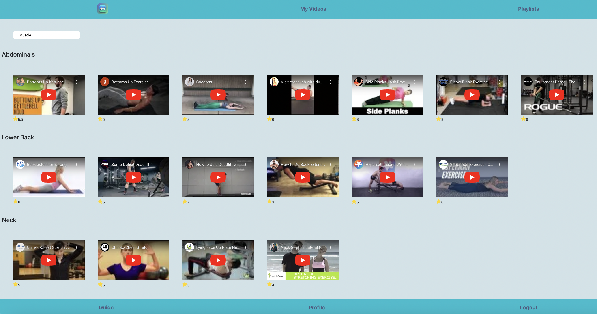
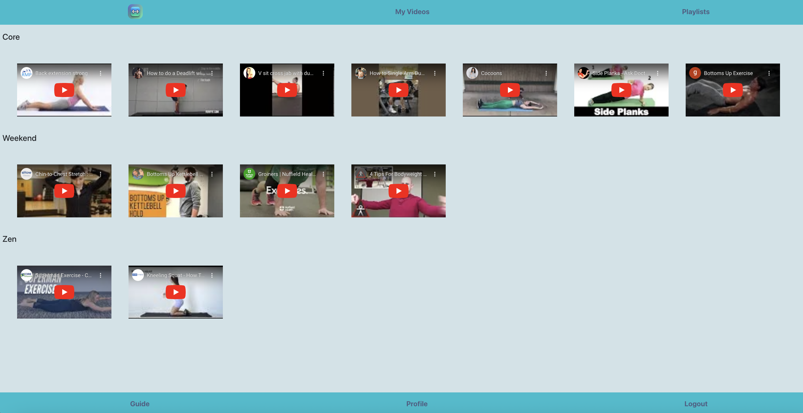

#Fitness
##My Videos

##Playlists


##Description

[Fitness](https://react-fitness-9b5g.onrender.com/) is a web application designed to help users find workout exercises through YouTube videos. Users can save videos from a large collection, then create playlists from their saved videos to combine different exercises for a complete workout. They can also rate the videos they've saved.

## Features

- **Searching for exercises**: Users can search for exercises by specific muscle groups, with results displayed as a list of exercise names with links.
- **Save and rate videos**: By clicking on an exercise name, users are shown a list of YouTube videos. They can save  and rate videos from this list.
- **Create playlists**: Users can create playlists from saved videos, mixing different types of exercises within a single playlist.
- **User Authentication**: Users can register, log in, save YouTube videos, create playlists, and recover their passwords if needed.


## User Flow

1. Users can search for exercises by specific muscle groups.
2. After logging in, users can navigate to a list of YouTube videos for a specific exercise name.
3. To save a video to 'My Videos,' users must click the plus sign on a green background. They can delete a video from 'My Videos' by clicking the X on a red background.
4. Users can add a video from 'My Videos' to a playlist by clicking the plus sign on a green background and typing the name of the playlist. Deleting a video from a playlist works the same way as it does with 'My Videos.' 
5. Users can access their profile page to update their information.
6. There is a guidance page on how to use this application.

## API

The Workout application uses the [api-workout](https://api-workout-sq1f.onrender.com/) to fetch embedded YouTube videos and their information. A total of 156 exerceses have also been collected and permanently saved from this source.

## Backend

The NodeJS backend handles the routing for the React frontend. [node-fitness](https://node-fitness.onrender.com/)

## Frontend

The frontend was created using React. [react-fitness](https://react-fitness-9b5g.onrender.com/) 

## How to Run
```
# Clone Repository
$ git clone https://github.com/bukkicsilla/react-fitness.git
$ npm install
$ npm start
```

## Technology Stack

- **Front-end**: React and Bootstrap
- **Back-end**: NodeJS
- **Database**: PostgreSQL

## Deployment

The application is deployed using [Render](https://render.com/), and the PostgreSQL database is hosted on [Supabase](https://supabase.com//).